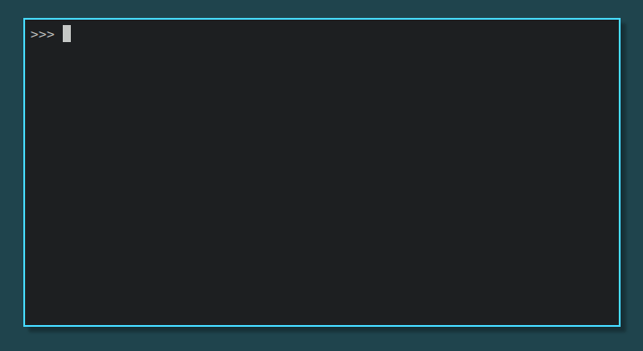

# Names

Names is a library to generate names using Markov Chains.




## Installation

Use o package manager [pip](https://pip.pypa.io/en/stable/) para instalar.

``` sh
$ pip install git+ssh://git@github.com/strafael/names.git
```

## Usage

``` python
>>> import names
>>> n = names.Names()
>>> n.gen()
'miranda_capaz'
>>> n.gen()
'beleb_voldemort'
>>> n.gen()
'skynet_indestrutivel'
>>> n.gen_with_start("jessica")
'jessica_potter'
```

## Development

These instructions will give you a copy of the project running in the your
local machine for development and testing purposes. See the session
`Installation` for instructions on how to install the project in a production.

To install the library and the dependencies you need for development and tests,
run the following command in a virtualenv:

``` sh
$ pip install -e .[dev]
```

# References

- [Markov Models for Text Analysis](https://www.stat.purdue.edu/~mdw/CSOI/MarkovLab.html)

# License

[MIT](https://gitlab.com/AureaRobotics/names/-/blob/master/LICENSE)
